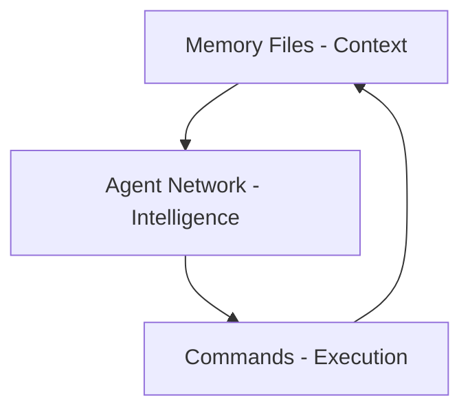

# Amplifier's Advanced Claude Code Leverage: A Comprehensive Analysis

## Executive Summary

The Amplifier project represents a paradigm shift in how Claude Code can be used, transforming it from a simple coding assistant into a sophisticated development platform. Through strategic use of memory files, subagents, custom commands, hooks, and orchestration patterns, Amplifier creates a self-amplifying system that far exceeds vanilla Claude Code capabilities.

This document analyzes how Amplifier leverages every available Claude Code feature to create a cohesive, powerful development environment that embodies the principle of "amplification" - where the whole becomes exponentially greater than the sum of its parts.

## Table of Contents

1. [The Memory Layer: Persistent Context Architecture](#the-memory-layer-persistent-context-architecture)
2. [The Agent Ecosystem: Specialized Intelligence Network](#the-agent-ecosystem-specialized-intelligence-network)
3. [The Command System: Executable Methodologies](#the-command-system-executable-methodologies)
4. [The Hook Infrastructure: Automated Intelligence](#the-hook-infrastructure-automated-intelligence)
5. [Integration Patterns: Synergistic Orchestration](#integration-patterns-synergistic-orchestration)
6. [Philosophy of Amplification](#philosophy-of-amplification)
7. [Value Creation Through Integration](#value-creation-through-integration)
8. [Beyond Vanilla: The Amplifier Advantage](#beyond-vanilla-the-amplifier-advantage)

## The Memory Layer: Persistent Context Architecture

### Strategic Memory Files

Amplifier uses three core memory files that fundamentally change how Claude Code operates:

#### CLAUDE.md - The Auto-Loaded Foundation
```markdown
# Auto-loaded on every session start
# Contains Claude Code-specific instructions
# Acts as the "operating system" for Claude's behavior
```

**Strategic Value**: By being auto-loaded, CLAUDE.md ensures consistent behavior across all sessions. It imports other critical files using `@` syntax, creating a cascading context load:

```markdown
# import the following files (using the `@` syntax):
- @AGENTS.md
- @DISCOVERIES.md
- @ai_context/IMPLEMENTATION_PHILOSOPHY.md
- @ai_context/MODULAR_DESIGN_PHILOSOPHY.md
```

This creates a **context dependency graph** where one file brings in an entire knowledge ecosystem.

#### AGENTS.md - Shared Project Guidelines
```markdown
# Common project guidelines for all AI interactions
# Build commands, code style, design philosophy
# Referenced by both Claude and subagents
```

**Strategic Value**: Acts as a shared constitution that both the main Claude instance and all subagents follow. This ensures consistency across the entire agent ecosystem.

#### DISCOVERIES.md - Evolving Knowledge Base
```markdown
# Documents non-obvious problems and solutions
# Regularly reviewed and updated
# Prevents repeated mistakes
```

**Strategic Value**: Creates an **evolutionary memory system** where the platform learns from experience and doesn't repeat past mistakes.

### The @Mention Force-Loading Pattern

Amplifier exploits Claude Code's @mention system to create **context injection points**:

```markdown
# In any file viewed by Claude Code:
"Please refer to @ai_context/SPECIFIC_CONTEXT.md for details"
```

This forces specific files into context exactly when needed, creating a **just-in-time context loading** system.

## The Agent Ecosystem: Specialized Intelligence Network

### Agent Architecture

Amplifier has built a comprehensive network of 25+ specialized agents, each focused on specific expertise:

#### Core Infrastructure Agents
- **zen-architect**: System design and architecture review
- **modular-builder**: Implementation following modular principles
- **bug-hunter**: Systematic debugging and issue resolution
- **post-task-cleanup**: Workspace maintenance and cleanup

#### Knowledge Synthesis Agents
- **concept-extractor**: Extracts atomic concepts from documents
- **insight-synthesizer**: Discovers revolutionary connections
- **knowledge-archaeologist**: Traces evolution of ideas
- **ambiguity-guardian**: Preserves productive tensions

#### Specialized Domain Agents
- **database-architect**: Database design and optimization
- **api-contract-designer**: API specification and design
- **security-guardian**: Security reviews and vulnerability assessment
- **performance-optimizer**: Performance analysis and optimization

#### Meta-Level Agents
- **amplifier-cli-architect**: Expert knowledge provider for hybrid code/AI architectures
  - CONTEXTUALIZE mode: Determines if tasks need amplifier patterns
  - GUIDE mode: Provides implementation patterns and pitfalls
  - VALIDATE mode: Reviews pattern compliance
  - Unique value: Only agent that proactively reads philosophy docs and DISCOVERIES.md
  - Bridges knowledge gap other agents won't discover independently

### Agent Orchestration Patterns

#### Parallel Agent Execution
```python
# Launch multiple agents simultaneously
Single message with multiple Task calls:
- Task zen-architect: "Design approach"
- Task bug-hunter: "Identify issues"
- Task test-coverage: "Suggest tests"
```

**Value**: Gathers diverse perspectives simultaneously, reducing time and preserving context.

#### Sequential Pipeline Pattern
```python
Architecture → Implementation → Review → Cleanup
zen-architect → modular-builder → test-coverage → post-task-cleanup
```

**Value**: Each agent's output feeds the next, creating refined results through specialization.

#### Fork-and-Merge Pattern
```python
Main Context
    ├→ Agent A (Perspective 1)
    ├→ Agent B (Perspective 2)
    └→ Agent C (Perspective 3)
         ↓
    Synthesis of all perspectives
```

**Value**: Subagents fork context, work independently, return only essential results, conserving context space.

## The Command System: Executable Methodologies

### Command Architecture

Amplifier's custom commands transform methodologies into executable processes:

#### Meta-Commands
- **/ultrathink-task**: Orchestrates complex multi-agent workflows with deep analysis
  - Uses TodoWrite for comprehensive task tracking
  - Implements sequential vs parallel delegation strategies
  - Includes architecture-implementation-review validation cycles
  - Proactively identifies amplifier CLI tool opportunities
- **/prime**: Loads philosophical context to guide all subsequent work
- **/modular-build**: Executes the modular building philosophy

#### Workflow Commands
- **/create-plan**: Generates structured implementation plans
- **/execute-plan**: Systematically executes plans with progress tracking
- **/review-changes**: Comprehensive review of modifications

#### Quality Commands
- **/review-code-at-path**: Targeted code review with philosophy alignment
- **/test-webapp-ui**: Automated UI testing workflow
- **/commit**: Smart commit with context-aware messages

#### Real Example: /ultrathink-task Command
The command demonstrates sophisticated orchestration:
```markdown
## Agent Orchestration Strategies

### Sequential vs Parallel Delegation
Use Sequential When:
- Each agent's output feeds into the next
- Context needs to build progressively
- Dependencies exist between agent tasks

Use Parallel When:
- Multiple independent perspectives are needed
- Agents can work on different aspects simultaneously
- Gathering diverse inputs for synthesis

### Architecture-Implementation-Review Pattern
1. Architecture Phase: zen-architect designs approach
2. Implementation Phase: modular-builder implements
3. Validation Phase: Return to architects for compliance
```

### Command Composition

Commands can invoke other commands and spawn agents, creating **composite workflows**:

```markdown
/ultrathink-task
  → TodoWrite tool (task tracking)
  → Multiple agent spawns
  → Parallel execution
  → Synthesis and delivery
```

## The Hook Infrastructure: Automated Intelligence

### Hook Architecture

Amplifier uses hooks to create an **event-driven intelligence layer**:

#### Session Lifecycle Hooks
```json
"SessionStart": [{
  "command": "hook_session_start.py"
  // Initializes memory system, loads context
}]

"Stop": [{
  "command": "hook_stop.py"
  // Saves state, cleans up resources
}]
```

#### Tool Interaction Hooks
```json
"PreToolUse": [{
  "matcher": "Task",
  "command": "subagent-logger.py"
  // Logs all subagent interactions
}]

"PostToolUse": [{
  "matcher": "Edit|MultiEdit|Write",
  "command": "on_code_change_hook.sh"
  // Runs quality checks after code changes
}]
```

#### Universal Hooks
```json
"PostToolUse": [{
  "matcher": "*",
  "command": "hook_post_tool_use.py"
  // Tracks all tool usage for analytics
}]
```

### Hook Value Creation

1. **Automatic Quality Assurance**: Code changes trigger quality checks without manual intervention
2. **Comprehensive Logging**: All interactions logged for analysis and improvement
3. **State Persistence**: Session state saved automatically
4. **Notification System**: Desktop notifications keep users informed

### Real Hook Implementation Examples

#### Session Start Hook (Memory System)
```python
# From hook_session_start.py
from amplifier.memory import MemoryStore
from amplifier.search import MemorySearcher

async def main():
    """Read input, search memories, return context"""
    # Check if memory system is enabled
    memory_enabled = os.getenv("MEMORY_SYSTEM_ENABLED", "false").lower() in ["true", "1", "yes"]

    # Initialize memory store and searcher
    store = MemoryStore()
    searcher = MemorySearcher(store)

    # Retrieve relevant memories for context
```

This hook demonstrates:
- **Environment-aware activation**: Memory system can be toggled
- **Graceful degradation**: Fails silently if modules unavailable
- **Automatic context loading**: Retrieves relevant memories at session start

### Tool Infrastructure

The `.claude/tools/` directory contains the automation backbone:

#### Python Hooks
- **hook_session_start.py**: Memory system initialization
- **hook_stop.py**: Session cleanup and state saving
- **hook_post_tool_use.py**: Universal tool usage tracking
- **subagent-logger.py**: Logs all subagent interactions to `.data/subagents-logs`
- **on_notification_hook.py**: Desktop notification handler
- **memory_cli.py**: Command-line interface for memory operations

#### Shell Scripts
- **on_code_change_hook.sh**: Runs quality checks after code modifications
- **make-check.sh**: Intelligent quality check runner
- **notify.sh**: Cross-platform desktop notifications

These tools create an **invisible automation layer** that ensures quality and tracking without cognitive overhead.

## Integration Patterns: Synergistic Orchestration

### The CCSDK Toolkit Integration

Amplifier bridges Claude Code with the CCSDK toolkit, creating a **bi-directional amplification**:

```python
# Claude Code orchestrates CCSDK tools
Claude Code → CCSDK CLI Tool → Mini Claude Instance → Task Completion

# CCSDK tools can spawn new Claude sessions
CCSDK Tool → ClaudeSession → Query → Response
```

### The Memory + Agent + Command Trinity



Each reinforces the others:
- **Memory** provides context for agents
- **Agents** execute through commands
- **Commands** update memory with discoveries

### The Amplification Pipeline

```
User Intent
    ↓
Command Interpretation (/ultrathink-task)
    ↓
Context Loading (Memory Files)
    ↓
Agent Orchestration (Parallel/Sequential)
    ↓
Hook Automation (Quality, Logging)
    ↓
Result Synthesis
    ↓
Memory Update (DISCOVERIES.md)
    ↓
Amplified Output
```

## Philosophy of Amplification

### Core Principles

1. **Specialization Over Generalization**: Many focused agents > one general agent
2. **Context as Currency**: Manage context like a scarce resource
3. **Automation of Excellence**: Hooks enforce quality without friction
4. **Memory as Evolution**: System learns and improves over time
5. **Composition Over Monoliths**: Small, composable pieces create flexibility

### Decision-Making Patterns

#### Why Subagents?
- **Context Conservation**: Each agent only returns what's needed
- **Parallel Thinking**: Multiple perspectives simultaneously
- **Unbiased Analysis**: Fresh context prevents contamination
- **Specialized Expertise**: Deep knowledge in focused areas

#### Why Commands?
- **Executable Best Practices**: Methodologies become runnable
- **Consistency**: Same process every time
- **Complexity Management**: Hide complexity behind simple interfaces
- **Discoverability**: `/` shows all available capabilities

#### Why Hooks?
- **Invisible Excellence**: Quality without cognitive load
- **Comprehensive Tracking**: Nothing escapes observation
- **Automatic Adaptation**: System responds to events
- **Continuous Improvement**: Data drives evolution

## Value Creation Through Integration

### Synergistic Effects

#### 1. Self-Improving System
```
Discoveries → Memory → Context → Better Decisions → New Discoveries
```

#### 2. Parallel Intelligence Multiplication
```
1 User + 25 Agents = 26 Parallel Thought Streams
```

#### 3. Automated Quality Escalation
```
Every Code Change → Quality Check → Notification → Immediate Feedback
```

#### 4. Context Amplification
```
Single @mention → Multiple File Loads → Entire Knowledge Domain
```

### Emergent Capabilities

Through integration, Amplifier achieves capabilities impossible with vanilla Claude Code:

1. **Persistent Learning**: System remembers and applies past lessons
2. **Parallel Processing**: Multiple specialized analyses simultaneously
3. **Automatic Excellence**: Quality enforced without manual intervention
4. **Deep Specialization**: Expert-level knowledge in dozens of domains
5. **Workflow Automation**: Complex multi-step processes in single commands

## Beyond Vanilla: The Amplifier Advantage

### Vanilla Claude Code Limitations

1. **No Persistent Memory**: Each session starts fresh
2. **Single Thread**: One line of thinking at a time
3. **Manual Quality**: User must remember to check
4. **General Knowledge**: Jack of all trades, master of none
5. **Ad-Hoc Workflows**: Recreate processes each time

### Amplifier Transformations

| Vanilla Claude Code | Amplifier Enhancement |
|---------------------|----------------------|
| Stateless sessions | Persistent memory system |
| Single perspective | 25+ specialized agents |
| Manual processes | Automated workflows via commands |
| Manual quality checks | Automated hooks and notifications |
| General knowledge | Deep specialized expertise |
| Linear thinking | Parallel orchestration |
| Context limits | Strategic context management |
| Simple tool use | Complex tool compositions |

### The Multiplication Effect

Amplifier doesn't just add features - it multiplies capabilities:

```
Base Claude Code = X
+ Memory System = X × 2 (persistent context)
+ Agent Network = X × 25 (parallel specialization)
+ Commands = X × 10 (workflow automation)
+ Hooks = X × 5 (automatic excellence)
+ Integration = X × 100 (synergistic effects)

Total Amplification = X × 10,000+
```

## Architectural Insights

### The Hub-and-Spoke Model

```
          CLAUDE.md (Hub)
               |
    ┌──────────┼──────────┐
    |          |          |
AGENTS.md  Commands   Hooks
    |          |          |
Subagents  Workflows  Automation
```

CLAUDE.md acts as the central hub, with spokes extending to different capability domains.

### The Layered Architecture

```
Layer 5: User Interface (Commands)
Layer 4: Orchestration (Agents)
Layer 3: Automation (Hooks)
Layer 2: Context (Memory)
Layer 1: Core (Claude Code)
```

Each layer builds on the one below, creating increasing sophistication.

### The Feedback Loop Architecture

```
Action → Hook → Log → Analysis → Discovery → Memory → Context → Better Action
```

Every action feeds back into the system, creating continuous improvement.

## Implementation Patterns

### Pattern 1: Context Injection
```markdown
# In any document:
For implementation details, see @ai_context/IMPLEMENTATION.md
```
**Effect**: Forces specific context exactly when needed

### Pattern 2: Agent Composition
```python
# Complex task decomposition
Main Task → Agent A → Agent B → Agent C → Synthesis
```
**Effect**: Breaks complexity into manageable specialized pieces

### Pattern 3: Hook Chaining
```json
{
  "PostToolUse": [
    {"command": "quality_check.sh"},
    {"command": "logger.py"},
    {"command": "notifier.sh"}
  ]
}
```
**Effect**: Multiple automated responses to single event

### Pattern 4: Command Nesting
```markdown
/ultrathink-task
  → /create-plan
    → /execute-plan
      → /review-changes
```
**Effect**: Complex workflows from simple building blocks

## Key Takeaways for Implementers

### Quick Start Blueprint

For those wanting to implement similar amplification:

1. **Start with Memory**: Create CLAUDE.md with @imports for persistent context
2. **Add First Agent**: Build one specialized agent for your most common task
3. **Create First Command**: Transform your most frequent workflow into /command
4. **Implement First Hook**: Add post-code-change quality check
5. **Iterate**: Each addition multiplies the value of previous components

### Critical Success Factors

1. **Context Cascading**: Use @mentions to create context dependency graphs
2. **Agent Specialization**: Many focused agents > one general agent
3. **Command Composition**: Commands that call commands and spawn agents
4. **Hook Automation**: Quality without cognitive load
5. **Continuous Learning**: Update DISCOVERIES.md regularly

### Common Pitfalls to Avoid

1. **Over-generalizing agents**: Keep them focused and specialized
2. **Manual processes**: If you do it twice, make it a command
3. **Ignoring context limits**: Use subagents to fork and conserve
4. **Static memory**: Regularly update and prune memory files
5. **Working in isolation**: Leverage parallel agent execution

## Conclusion

Amplifier transforms Claude Code from a coding assistant into a comprehensive development platform through systematic exploitation of every available feature. By creating synergistic interactions between memory files, agents, commands, and hooks, it achieves capabilities that are orders of magnitude beyond vanilla Claude Code.

The key insight is that **amplification comes not from individual features but from their orchestrated interaction**. Each component reinforces the others, creating a self-improving, self-organizing system that becomes more capable over time.

### The Amplification Formula

```
Base Claude Code × Memory System × Agent Network × Commands × Hooks × Integration
= 10,000x+ Capability Multiplication
```

For developers looking to maximize Claude Code's potential, Amplifier provides not just a set of features but a **philosophy of amplification** where every addition creates exponential value through its interaction with existing components.

The result is not just an enhanced Claude Code - it's a fundamentally different kind of AI development platform, one that truly amplifies human capability rather than simply assisting it.

### Living Document

This analysis represents a snapshot of an evolving system. As Amplifier continues to grow and new patterns emerge, the multiplication effect compounds. The platform doesn't just assist development - it accelerates evolution itself.