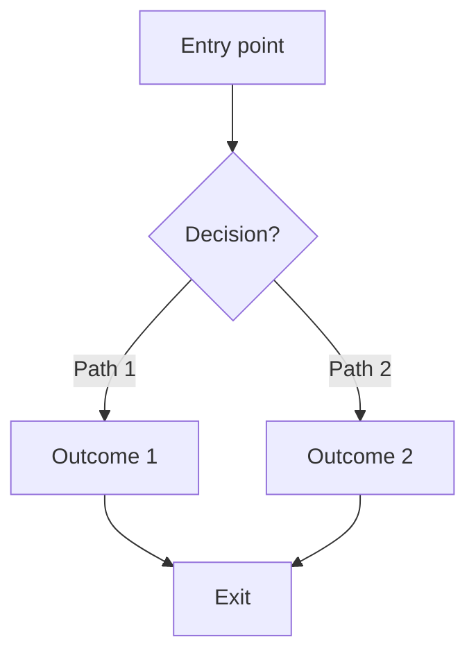

# [Feature Name] Requirements

**Purpose**: [One sentence describing what this feature does and why it matters]

**Status**: Draft | In Review | Approved | Implemented
**Created**: [Date]
**Last Updated**: [Date]
**Owner**: [Name/Team]

---

## 1. Purpose & Intent (Layer 1)

### Should this exist?

**Problem being solved**:
[Clear statement of the problem this feature addresses]

**Simplest solution**:
[Why this approach is the simplest way to solve the problem]

**Alternatives considered**:
1. [Alternative 1] - Rejected because [reason]
2. [Alternative 2] - Rejected because [reason]
3. [Alternative 3] - Rejected because [reason]

### For whom?

**Target users**:
[Describe who will use this feature - be specific]

**User needs**:
- [Specific need 1]
- [Specific need 2]
- [Specific need 3]

**Context of use**:
[When and where will this feature be used? What's the user's environment/state?]

### Values embodied

Verify alignment with our Five Pillars:

- [ ] **Purpose Drives Execution** - Why is clear and documented
- [ ] **Craft Embeds Care** - Details will be refined, edge cases considered
- [ ] **Constraints Enable Creativity** - Works within our design system
- [ ] **Intentional Incompleteness** - Leaves room for user expression
- [ ] **Design for Humans** - Accessible and ergonomic by design

**Cultural/Emotional resonance**:
[What makes this meaningful to our users? What values does this embody?]

---

## 2. User Stories

**Format**: As a [user type], I want [action] so that [benefit]

### Primary Stories
1. As a [user type], I want [action], so that [benefit]
2. As a [user type], I want [action], so that [benefit]
3. As a [user type], I want [action], so that [benefit]

### Secondary Stories (Nice to Have)
1. As a [user type], I want [action], so that [benefit]
2. As a [user type], I want [action], so that [benefit]

---

## 3. Aesthetic Requirements (Nine Dimensions)

### Style
**Visual language**: [Swedish design studio: playful + refined, warm + confident]

**Reference aesthetic**:
- Primary inspiration: [e.g., Linear's smoothness, Coolors' playfulness]
- Specific elements: [What specifically resonates from reference?]

**Key visual characteristics**:
- [Characteristic 1]
- [Characteristic 2]
- [Characteristic 3]

### Motion
**Timing targets**:
- Instant feedback (<100ms): [Which interactions?]
- Responsive (100-300ms): [Which interactions?]
- Deliberate (300-1000ms): [Which interactions?]

**Easing curves**:
- Smooth: `cubic-bezier(0.4, 0, 0.2, 1)` for [which elements?]
- Spring: `cubic-bezier(0.34, 1.56, 0.64, 1)` for [which elements?]

**Key transitions**:
1. [Transition name]: [duration] over [easing] because [rationale]
2. [Transition name]: [duration] over [easing] because [rationale]

**Reduced motion fallback**:
[How does this behave when user prefers reduced motion?]

### Voice
**Personality**: [Confident, warm, not corporate - specific to this feature]

**Tone adaptations**:
- Success: [How copy sounds when things go well]
- Error: [How copy sounds when things go wrong - helpful, not blaming]
- Loading: [How copy sounds during wait states - conversational]
- Empty: [How copy sounds with no content - inviting, not punishing]

**Example copy**:
- Button label: "[example]"
- Success message: "[example]"
- Error message: "[example]"
- Empty state: "[example]"

### Space
**Layout approach**: [Generous spacing (premium) or efficient (utilitarian)?]

**Hierarchy strategy**:
[How does spacing create visual hierarchy and guide attention?]

**Spacing rhythm** (from 8px system):
- Major sections: [48px? 64px? 96px?]
- Related elements: [24px? 32px?]
- Grouped elements: [16px? 12px?]
- Tight grouping: [8px? 4px?]

**Simplicity test**: [Can you remove 20% without losing function?]

### Color
**Palette choice**: [Which themed palette fits emotional goal?]
- Coral & Teal (playful, energetic)
- Swedish Summer (yellow/green, warm)
- Nordic Berry (pink/purple, sophisticated)
- Ocean Depth (blue/purple, mysterious)
- Sunset Glow (orange/pink, optimistic)
- Custom: [If custom, specify and rationale]

**Color application**:
- Background: [Soft, warm base - which specific value?]
- Text: [Vibrant, confident - which specific value?]
- Accent: [Complementary, bold - which specific value?]
- Interactive elements: [How color reveals through interaction]

**Contrast validation**:
- [ ] Text contrast: 4.5:1 minimum achieved
- [ ] UI component contrast: 3:1 minimum achieved
- [ ] Color blind simulation tested

**Cultural considerations**:
[Any cultural meanings of colors to consider?]

### Typography
**Typefaces**:
- Headings: [Sora - which weights?]
- Body: [Geist Sans - which weights?]
- Code/Technical: [Geist Mono - which weights?]

**Hierarchy**:
- H1: [size, weight, color, line-height]
- H2: [size, weight, color, line-height]
- H3: [size, weight, color, line-height]
- Body: [size, weight, color, line-height]
- Caption: [size, weight, color, line-height]

**Line height**: [1.125-1.5× font size for readability]
**Line length**: [45-75 characters optimal for body text]

### Proportion
**Scale system**: [8px spacing grid]

**Scale relationships**:
[How do elements relate in size? Golden ratio? Fibonacci? Rule of thirds?]

**Visual adjustment**:
[Where does optical/visual adjustment override mathematical precision?]

### Texture
**Materiality**: [Subtle depth, colored shadows, radial gradients?]

**Purpose of texture**:
[Why is texture used? What does it add? NOT decoration for decoration's sake]

**Specific applications**:
- [Element]: [texture type] because [reason]

### Body (Ergonomics)
**Touch targets**:
- [ ] All interactive elements: 44x44px minimum (Apple) or 48x48dp (Android)
- [ ] Mobile thumb zones optimized (bottom third priority)

**Keyboard navigation**:
- [ ] Full functionality available without mouse
- [ ] Tab order logical and efficient
- [ ] Focus indicators clear (2px accent outline)

**Physical interaction tested**:
- [ ] Real devices (not just browser simulation)
- [ ] Various hand sizes
- [ ] One-handed mobile use

---

## 4. Functional Requirements

### Core Capabilities
1. [Requirement 1 - What it must do]
2. [Requirement 2 - What it must do]
3. [Requirement 3 - What it must do]
4. [Requirement 4 - What it must do]

### Edge Cases
**[Edge case 1]**: [Expected behavior]
**[Edge case 2]**: [Expected behavior]
**[Edge case 3]**: [Expected behavior]

### Error Scenarios
**[Error 1]**: [How it's handled and what user sees]
**[Error 2]**: [How it's handled and what user sees]
**[Error 3]**: [How it's handled and what user sees]

### State Coverage
- [ ] **Loading state** - What user sees while waiting
- [ ] **Error state** - How errors are displayed and resolved
- [ ] **Empty state** - What shows when no content exists
- [ ] **Success state** - How success is confirmed to user

---

## 5. Acceptance Criteria (Given/When/Then)

### Functional Acceptance

**Scenario 1**:
```
Given [context/precondition]
When [user action]
Then [expected functional outcome]
```

**Scenario 2**:
```
Given [context/precondition]
When [user action]
Then [expected functional outcome]
```

**Scenario 3**:
```
Given [context/precondition]
When [user action]
Then [expected functional outcome]
```

### Aesthetic Acceptance (Studio-specific)

**Interaction 1**:
```
Given [trigger/context]
When [user performs action]
Then [aesthetic outcome]:
- Timing: [specific duration, e.g., 500ms]
- Feel: [specific quality, e.g., smooth, deliberate, responsive]
- Visual feedback: [specific changes, e.g., lift 2px, colored shadow]
```

**Interaction 2**:
```
Given [trigger/context]
When [user performs action]
Then [aesthetic outcome]:
- Timing: [specific duration]
- Feel: [specific quality]
- Visual feedback: [specific changes]
```

### Accessibility Acceptance

**Keyboard Navigation**:
```
Given a keyboard-only user
When they tab through the interface
Then all interactive elements are reachable
And focus order is logical
And focus indicators are visible (2px accent outline)
```

**Screen Reader**:
```
Given a screen reader user
When they navigate this feature
Then all interactive elements have descriptive ARIA labels
And state changes are announced via aria-live
And no information is conveyed by color alone
```

**Reduced Motion**:
```
Given a user with prefers-reduced-motion enabled
When they interact with this feature
Then all animations complete in <50ms (essentially instant)
And functionality is preserved
And no essential information is lost
```

**Touch Accessibility**:
```
Given a mobile user
When they tap interactive elements
Then all targets are 44x44px minimum
And thumb zones are prioritized (bottom third)
And tap feedback is immediate (<100ms)
```

---

## 6. Component Specifications

### Component Hierarchy
```
<FeatureName>
  <FeatureHeader>
    <Heading />
    <ActionButton variant="accent" />
  </FeatureHeader>
  <FeatureContent>
    <ComponentA />
    <ComponentB />
  </FeatureContent>
  <FeatureFooter />
</FeatureName>
```

### Props Interfaces (TypeScript)

**ComponentA**:
```typescript
interface ComponentAProps {
  variant?: 'default' | 'accent' | 'subtle'
  size?: 'sm' | 'md' | 'lg'
  onAction?: () => void
  disabled?: boolean
  children: React.ReactNode
}
```

**ComponentB**:
```typescript
interface ComponentBProps {
  // Define props
}
```

### State Management

**Approach**: [Choose one]
- [ ] Zustand global store (for app-wide state like theme/palette)
- [ ] Local useState (for component-specific state)
- [ ] React Context (for shared state within feature)

**State shape**:
```typescript
interface FeatureState {
  // Define state structure
}
```

**Actions**:
```typescript
// Define state update functions
```

### Styling Approach

**CSS Variables** (to be defined in `globals.css`):
```css
--feature-background: [value]
--feature-accent: [value]
--feature-text: [value]
--feature-border: [value]
/* ... */
```

**CSS Modules**: [Which components need scoped styles?]

**Inline Styles**: [Which elements need dynamic theming?]

---

## 7. Non-Functional Requirements

### Performance
- **Load time target**: [e.g., <2s initial, <500ms subsequent]
- **Interaction response**: [e.g., <100ms for feedback, <300ms for transitions]
- **Animation performance**: [60fps required, GPU acceleration where?]
- **Bundle impact**: [Maximum acceptable size increase]

### Security
- **Data handling**: [How is sensitive data treated?]
- **Authentication**: [What auth requirements exist?]
- **Authorization**: [What permission checks needed?]
- **Input validation**: [What inputs need sanitization?]

### Scalability
- **Expected load**: [Number of users, data volume]
- **Growth considerations**: [How does this scale?]
- **Performance under stress**: [Degradation strategy]

### Browser/Device Support
- **Browsers**: Chrome (latest 2), Safari (latest 2), Firefox (latest 2)
- **Devices**: Desktop, tablet, mobile (320px minimum width)
- **OS**: macOS, Windows, iOS, Android

---

## 8. Out of Scope

**Explicitly NOT included in this feature**:

1. **[Out of scope item 1]**
   - Reason: [Why excluded]
   - Future consideration: [Maybe later? Never?]

2. **[Out of scope item 2]**
   - Reason: [Why excluded]
   - Future consideration: [Maybe later? Never?]

3. **[Out of scope item 3]**
   - Reason: [Why excluded]
   - Future consideration: [Maybe later? Never?]

**Rationale for scope boundaries**:
[Why these boundaries exist - prevents scope creep, focuses on core value, technical constraints, etc.]

---

## 9. Design Artifacts

- [ ] **Wireframes created**: [Link to `.design/wireframes/[feature-name]-ux.md`]
- [ ] **User flow diagram**: [Link to Mermaid diagram in wireframes doc]
- [ ] **Interaction specifications**: [Link to detailed interaction specs]
- [ ] **Component API defined**: [Link to Props interfaces above]

### User Flow (Mermaid) - If Not in Wireframes Doc



---

## 10. Validation Checklist

### Design System Compliance
- [ ] All CSS variables will be defined in `globals.css` before use
- [ ] All fonts from approved set: Sora, Geist Sans, Geist Mono
- [ ] Spacing uses 8px system (4, 8, 12, 16, 24, 32, 48, 64, 96, 128)
- [ ] No emojis as UI elements (use Icon component)
- [ ] No Unicode characters as icons (use Icon component)

### Aesthetic Quality
- [ ] All Nine Dimensions addressed with specificity
- [ ] Emotional tone clearly defined
- [ ] Interaction timing specified (not arbitrary)
- [ ] Color palette choice justified
- [ ] Motion respects user preferences (reduced motion)

### Accessibility
- [ ] Text contrast: 4.5:1 minimum achieved
- [ ] UI component contrast: 3:1 minimum achieved
- [ ] Touch targets: 44x44px minimum for all interactive elements
- [ ] Keyboard navigation: Full functionality without mouse
- [ ] ARIA labels: Specific and descriptive
- [ ] Screen reader: State changes announced
- [ ] Reduced motion: Fallback behavior defined

### Five Pillars Embodied
- [ ] **Purpose Drives Execution** - Clear "why" documented
- [ ] **Craft Embeds Care** - Edge cases, error states, loading states addressed
- [ ] **Constraints Enable Creativity** - Works within design system
- [ ] **Intentional Incompleteness** - Room for user expression
- [ ] **Design for Humans** - Accessible, ergonomic, tested with real users

### Completeness
- [ ] User stories capture all primary use cases
- [ ] Functional requirements are testable
- [ ] Acceptance criteria cover functional AND aesthetic outcomes
- [ ] All states documented (loading, error, empty, success)
- [ ] Out of scope clearly defined
- [ ] Design artifacts created or planned

---

## 11. Implementation Notes

### Dependencies
- **Technical**: [What other systems/components does this depend on?]
- **Design**: [What design tokens/components must exist first?]
- **Data**: [What data sources/APIs are required?]

### Risks & Mitigations
1. **[Risk 1]**: [Mitigation strategy]
2. **[Risk 2]**: [Mitigation strategy]
3. **[Risk 3]**: [Mitigation strategy]

### Open Questions
- [ ] **[Question 1]**: [What needs clarification?]
- [ ] **[Question 2]**: [What needs decision?]
- [ ] **[Question 3]**: [What needs research?]

---

## 12. Success Metrics

### User Success
- [Metric 1]: [Target value]
- [Metric 2]: [Target value]
- [Metric 3]: [Target value]

### Quality Metrics
- **9.5/10 quality maintained**: [How measured? User feedback? Expert review?]
- **Accessibility score**: 100% WCAG AA compliance
- **Performance**: [Specific targets met]

### Business Metrics
- [Metric 1]: [Target value]
- [Metric 2]: [Target value]

---

## Revision History

| Date | Version | Changes | Author |
|------|---------|---------|--------|
| [Date] | 1.0 | Initial draft | [Name] |
| [Date] | 1.1 | [What changed] | [Name] |

---

## Notes

[Any additional context, decisions, or rationale that doesn't fit above]

---

**Remember**: This requirements document is the blueprint for implementation. It should be:
- **Clear** - No ambiguity about what should be built
- **Complete** - All necessary information present
- **Aligned** - Embodies our Five Pillars and Nine Dimensions
- **Actionable** - Engineers can implement without constant clarification
- **Aesthetic** - Polish built-in from first pass, not added later

**Quality at creation beats debugging later.**
