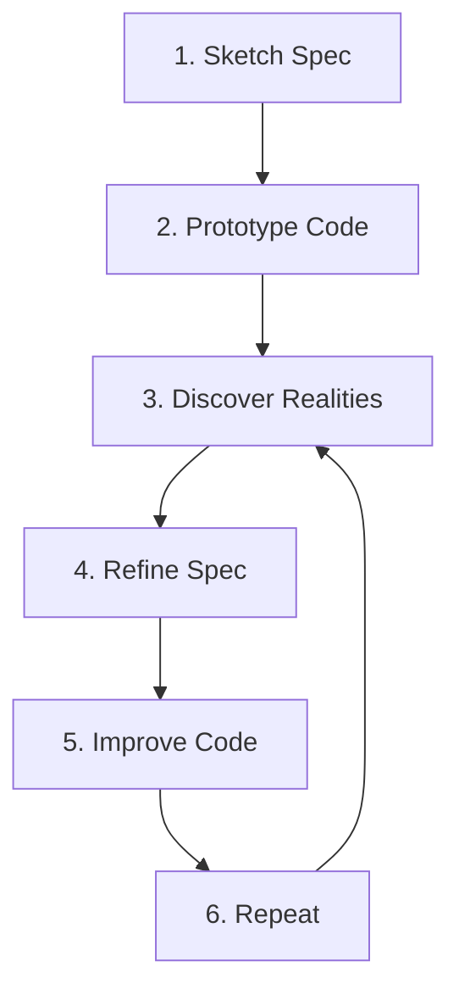

# Forge Improvement Plan

**Created:** 2025-11-12
**Based on:** Testing Analysis Report v1.0
**Status:** Active
**Target Completion:** 2025-11-26 (2 weeks)

---

## Overview

This improvement plan addresses critical gaps identified in the Forge testing initiative. It provides a **prioritized, actionable roadmap** to elevate the Forge system from 7.23/10 to 8.5+/10.

### Goals

1. **Fix broken references** - Restore dependency graph integrity
2. **Implement functional tools** - Make principles actionable
3. **Validate compositions** - Ensure elements work together
4. **Add missing elements** - Complete the element library
5. **Establish metrics** - Enable measurement and improvement

---

## Priority 1: Critical Fixes (Week 1)

### Must complete before deploying Forge

---

### 1.1 Fix Broken References in ruthless-minimalism

**Impact:** HIGH | **Effort:** LOW | **Duration:** 1-2 hours

**Problem:**
- 50% of outbound references are broken (2/4 invalid)
- References non-existent elements: emergent-design, waterfall, formal-verification
- Cannot resolve dependencies or validate conflicts

**Solution:**

**Option A: Remove Broken References (Quick Fix)**
```yaml
# Edit: forge/elements/principle/ruthless-minimalism/element.yaml

# Current (broken):
dependencies:
  suggests: [coevolution, emergent-design]
conflicts:
  principles: [waterfall, formal-verification]

# Fixed:
dependencies:
  suggests: [coevolution]
conflicts:
  principles: []
  reason: "Conflicts with upfront planning methodologies (to be formalized)"
```

**Option B: Create Missing Elements (Complete Fix)**
- Create emergent-design principle
- Create placeholder waterfall principle
- Create placeholder formal-verification principle

**Recommendation:** Option A for immediate fix, then create emergent-design as Priority 2

**Acceptance Criteria:**
- [ ] All references in ruthless-minimalism resolve successfully
- [ ] Reference integrity score increases to 100%
- [ ] Element loader validates dependencies without errors
- [ ] Update test report with new metrics

**Owner:** Core team
**Due:** Day 1

---

### 1.2 Implement scaffold Tool (Minimal Viable Version)

**Impact:** HIGH | **Effort:** HIGH | **Duration:** 1-2 days

**Problem:**
- scaffold is 0% functional (no templates, no scripts)
- Tool elements have 4.0/10 average (critical failure)
- Cannot demonstrate tool capability to users

**Solution:**

**Phase 1: Python Template (Day 1)**

Create minimal Python project template:

```bash
forge/elements/tool/scaffold/templates/python/
├── README.md.template
├── setup.py.template
├── pyproject.toml.template
├── requirements.txt.template
├── .gitignore.template
├── src/
│   ├── __init__.py.template
│   └── main.py.template
└── tests/
    ├── __init__.py.template
    └── test_main.py.template
```

**Phase 2: Scaffolding Script (Day 2)**

```bash
forge/elements/tool/scaffold/scripts/bash/scaffold.sh
```

Script should:
1. Accept project_type and project_name as arguments
2. Copy template directory
3. Replace {{variables}} in template files
4. Initialize git repository
5. Output list of created files

**Phase 3: Update element.yaml**

```yaml
implementation:
  instructions_file: scaffold.md
  scripts:
    sh: scripts/bash/scaffold.sh
  agent_scripts: null
  allowed_tools: [Bash, Write, Edit]

settings:
  category: scaffolding
  default_license: MIT
  init_git: true
  template_dir: templates/
```

**Acceptance Criteria:**
- [ ] Can scaffold Python project from command line
- [ ] Generated project has all template files
- [ ] Variables are replaced correctly
- [ ] Git repository initialized
- [ ] Test report shows 7+/10 score for scaffold
- [ ] At least one successful manual test

**Owner:** Tool team
**Due:** Day 2-3

---

### 1.3 Conduct Initial Composition Testing

**Impact:** CRITICAL | **Effort:** MEDIUM | **Duration:** 4-8 hours

**Problem:**
- Zero composition testing conducted
- Unknown how elements interact
- Risk of conflicts, circular dependencies, or incompatibilities

**Solution:**

Create `forge/testing/composition_test_results/` and test:

#### Test 1: Minimal Composition
```yaml
# Test: coevolution + ruthless-minimalism
composition: minimal-development
elements:
  - coevolution (principle)
  - ruthless-minimalism (principle)
scenario: Build simple CLI tool
expected_behavior: Fast iteration with spec-code dialogue
```

#### Test 2: Example Composition Validation
```yaml
# Test: example-composition.yaml (existing)
elements: [as defined in file]
scenario: Follow example composition instructions
expected_behavior: Elements load, no conflicts
```

#### Test 3: Dependency Chain
```yaml
# Test: analysis-first → ruthless-minimalism → coevolution
composition: analysis-chain
elements:
  - analysis-first (depends on ruthless-minimalism)
  - ruthless-minimalism (suggests coevolution)
  - coevolution
scenario: Analyze problem then build minimally
expected_behavior: Principles complement each other
```

**Deliverables:**
- `composition_test_results/minimal-development/report.md`
- `composition_test_results/example-composition/report.md`
- `composition_test_results/analysis-chain/report.md`
- `composition_test_results/SUMMARY.md`

**Acceptance Criteria:**
- [ ] All 3 compositions tested
- [ ] Reports document interactions, conflicts, synergies
- [ ] Composition patterns identified
- [ ] Anti-patterns identified
- [ ] Recommendations for composition best practices

**Owner:** Testing team
**Due:** Day 3-4

---

### 1.4 Create Missing Critical Elements

**Impact:** HIGH | **Effort:** MEDIUM | **Duration:** 4-6 hours

**Problem:**
- 4 referenced elements don't exist
- Breaks dependency resolution
- Cannot validate philosophical conflicts

**Solution:**

#### Create: emergent-design (Priority: HIGH)
```yaml
# forge/elements/principle/emergent-design/element.yaml
metadata:
  name: emergent-design
  type: principle
  version: 1.0.0
  description: Design emerges from iterative development rather than upfront planning
  author: core
  tags: [emergence, architecture, evolution]
  license: MIT

dependencies:
  suggests: [coevolution, ruthless-minimalism]

conflicts:
  principles: [waterfall]
  reason: Rejects big upfront design
```

**Content:** Write 150+ line markdown documenting:
- Core tenet: Design emerges through iteration
- How it complements ruthless-minimalism
- When emergence works vs. when planning needed
- Examples of emergent vs. planned architecture

#### Create: specification-driven-absolute (Priority: MEDIUM)
```yaml
# forge/elements/principle/specification-driven-absolute/element.yaml
metadata:
  name: specification-driven-absolute
  type: principle
  version: 1.0.0
  description: Specifications are the single source of truth; code implements specs exactly
  author: core
  tags: [spec-first, formal, rigorous]
  license: MIT

conflicts:
  principles: [coevolution, ruthless-minimalism]
  reason: Rejects spec-code dialogue and minimalism
```

**Content:** Minimal 50+ line markdown (placeholder quality):
- Core tenet: Spec is authoritative
- Why coevolution conflicts with it
- When this approach is appropriate (safety-critical, formal systems)

#### Create: waterfall (Optional - Placeholder)
Basic principle documenting waterfall methodology (for conflicts only)

#### Create: formal-verification (Optional - Placeholder)
Basic principle documenting formal proofs (for conflicts only)

**Acceptance Criteria:**
- [ ] emergent-design is complete and tested (8+/10)
- [ ] specification-driven-absolute is complete (7+/10)
- [ ] All references in existing elements now resolve
- [ ] Reference integrity increases to 90%+

**Owner:** Principle team
**Due:** Day 4-5

---

## Priority 2: Important Improvements (Week 2)

### Should complete to reach production quality

---

### 2.1 Add Metrics to All Elements

**Impact:** MEDIUM | **Effort:** LOW-MEDIUM | **Duration:** 3-4 hours total

**Problem:**
- No quantitative measures of success
- Cannot track adherence or effectiveness
- No data-driven improvement

**Solution:**

#### For coevolution:
```yaml
# Add to element.yaml
settings:
  metrics:
    spec_code_alignment_percentage: # % of spec matched by code
      min: 70
      target: 90
    dialogue_frequency_per_week: # Spec-code sync frequency
      min: 2
      target: 5
    discovery_rate_per_iteration: # New requirements found
      min: 1
      target: 3
```

Add metrics documentation to coevolution.md:
```markdown
## Measuring Coevolution Effectiveness

### Key Metrics

1. **Spec-Code Alignment** - What % of spec is reflected in code?
2. **Dialogue Frequency** - How often do spec and code sync?
3. **Discovery Rate** - How many new requirements emerge per iteration?

### Healthy Ranges
- Alignment: 70-90% (100% may indicate over-specification)
- Frequency: 2-5 times per week
- Discoveries: 1-3 per iteration (more suggests poor initial understanding)
```

#### For ruthless-minimalism:
```yaml
settings:
  metrics:
    lines_of_code_per_feature:
      max: 100
      target: 50
    time_to_mvp_hours:
      max: 8
      target: 4
    dependency_count:
      max: 10
      target: 5
    features_deferred_vs_implemented_ratio:
      min: 2.0  # At least 2 deferred per 1 implemented
```

#### For scaffold:
```yaml
settings:
  metrics:
    scaffold_time_seconds:
      max: 30
      target: 10
    files_created_count:
      min: 5
    template_coverage_percentage:
      target: 100
```

**Acceptance Criteria:**
- [ ] All 3 tested elements have metrics defined
- [ ] Metrics are measurable and actionable
- [ ] Documentation explains how to measure
- [ ] Test reports include metric evaluation

**Owner:** Core team
**Due:** Day 6

---

### 2.2 Create Supporting Tools for coevolution

**Impact:** MEDIUM | **Effort:** HIGH | **Duration:** 2-3 days

**Problem:**
- coevolution principle has no tooling support
- Users must manually track spec-code dialogue
- No automation for coevolution workflow

**Solution:**

#### Tool 1: spec-sync
```yaml
# forge/elements/tool/spec-sync/element.yaml
metadata:
  name: spec-sync
  type: tool
  version: 1.0.0
  description: Checks alignment between specifications and code

implementation:
  instructions: |
    1. Parse specification files (*.spec.md)
    2. Extract requirements/features
    3. Scan code for implementation
    4. Report alignment percentage
    5. Identify gaps (in spec but not code, in code but not spec)
```

**MVP Implementation:**
- Bash script that:
  - Finds spec files
  - Extracts TODO/FEATURE markers
  - Searches code for references
  - Outputs alignment report

#### Tool 2: discovery-capture
```yaml
# forge/elements/tool/discovery-capture/element.yaml
metadata:
  name: discovery-capture
  type: tool
  version: 1.0.0
  description: Quickly log implementation discoveries for spec updates

implementation:
  instructions: |
    1. Prompt user for discovery
    2. Categorize (new requirement, changed requirement, removed assumption)
    3. Append to DISCOVERIES.md
    4. Link to relevant spec section
```

**MVP Implementation:**
- Simple CLI: `discovery-capture "Found that users need password reset"`
- Appends to DISCOVERIES.md with timestamp
- Marks for spec update

#### Tool 3: coevo-status (Optional)
Dashboard showing coevolution health metrics

**Acceptance Criteria:**
- [ ] spec-sync implemented and tested
- [ ] discovery-capture implemented and tested
- [ ] Tools integrated with coevolution principle
- [ ] Documentation shows how to use tools
- [ ] At least one workflow test using tools

**Owner:** Tool team
**Due:** Day 7-9

---

### 2.3 Add Anti-Patterns to All Elements

**Impact:** MEDIUM | **Effort:** LOW | **Duration:** 2 hours

**Problem:**
- Only coevolution documents anti-patterns
- Users may misuse elements
- No "what NOT to do" guidance

**Solution:**

#### For ruthless-minimalism:
```markdown
## Anti-Patterns

### ❌ Minimalism as Excuse for Poor Quality
**What it looks like:** Skipping tests, ignoring errors, accepting broken code
**Why it's wrong:** Minimalism is about features, not quality
**Fix:** Be minimal in features, rigorous in quality

### ❌ Skipping All Planning
**What it looks like:** Writing code before understanding the problem
**Why it's wrong:** Minimalism defers implementation, not understanding
**Fix:** Understand the problem first, then build minimally

### ❌ Ignoring Security for Speed
**What it looks like:** Skipping auth, validation, or encryption to ship faster
**Why it's wrong:** Security breaches cost more than upfront time
**Fix:** Build secure MVPs, defer features not security

### ❌ Permanent Minimalism
**What it looks like:** Refusing to evolve beyond MVP
**Why it's wrong:** Minimalism is a starting point, not an end state
**Fix:** Start minimal, evolve based on real needs
```

#### For scaffold:
```markdown
## Anti-Patterns

### ❌ Over-Engineering Templates
**What it looks like:** Templates with every possible feature
**Why it's wrong:** Contradicts the purpose of scaffolding
**Fix:** Minimal templates, let users add what they need

### ❌ No Customization
**What it looks like:** Generated projects all identical
**Why it's wrong:** Every project has unique needs
**Fix:** Support template variables and options

### ❌ Template Rot
**What it looks like:** Templates using outdated dependencies or patterns
**Why it's wrong:** Scaffolds broken projects
**Fix:** Regularly update and test templates
```

**Acceptance Criteria:**
- [ ] ruthless-minimalism has 4+ anti-patterns documented
- [ ] scaffold has 3+ anti-patterns documented
- [ ] Anti-patterns follow format: what/why/fix
- [ ] Examples included where helpful

**Owner:** Documentation team
**Due:** Day 8

---

### 2.4 Conduct Workflow Testing

**Impact:** MEDIUM | **Effort:** MEDIUM-HIGH | **Duration:** 1-2 days

**Problem:**
- No end-to-end workflow validation
- Unknown how Forge performs in real scenarios
- Missing practical usage patterns

**Solution:**

Create `forge/testing/workflow_test_results/` and test:

#### Workflow 1: Greenfield Project
```
Scenario: Build new CLI tool from scratch
Elements: coevolution + ruthless-minimalism + scaffold
Steps:
  1. Scaffold Python project
  2. Write minimal spec
  3. Implement minimal version
  4. Capture discoveries
  5. Update spec
  6. Iterate
Duration: 2-3 hours
Metrics: Time to working MVP, spec-code alignment, features deferred
```

#### Workflow 2: Bug Fix with Context
```
Scenario: Fix bug in existing code
Elements: analysis-first + ruthless-minimalism
Steps:
  1. Analyze bug systematically
  2. Identify minimal fix
  3. Implement
  4. Test
  5. Document
Duration: 30-60 minutes
Metrics: Time to fix, code changed, tests added
```

#### Workflow 3: Documentation Creation
```
Scenario: Document existing undocumented code
Elements: ruthless-minimalism + respect-user-time
Steps:
  1. Identify critical paths
  2. Document essentials only
  3. Defer comprehensive docs
  4. Get user feedback
  5. Iterate
Duration: 1-2 hours
Metrics: Documentation coverage, user comprehension, time spent
```

**Deliverables:**
- `workflow_test_results/greenfield-project/report.md`
- `workflow_test_results/bug-fix/report.md`
- `workflow_test_results/documentation/report.md`
- `workflow_test_results/SUMMARY.md`

**Acceptance Criteria:**
- [ ] All 3 workflows tested end-to-end
- [ ] Success criteria met for each
- [ ] Workflow patterns documented
- [ ] Issues and blockers identified
- [ ] Recommendations for workflow improvements

**Owner:** Testing team
**Due:** Day 9-10

---

### 2.5 Create Dependency Validator

**Impact:** MEDIUM | **Effort:** MEDIUM | **Duration:** 3-4 hours

**Problem:**
- Broken references only found during manual testing
- No automated validation
- Reference integrity issues can spread

**Solution:**

Create validation script:

```python
# forge/scripts/validate-references.py

import yaml
from pathlib import Path

def validate_element_references():
    """Validate all element references in Forge"""

    # Load all elements
    elements = load_all_elements()
    element_names = {e['name'] for e in elements}

    # Check each element's references
    broken_refs = []

    for element in elements:
        # Check dependencies
        for dep_type in ['principles', 'tools', 'agents', 'templates']:
            for dep in element.get('dependencies', {}).get(dep_type, []):
                if dep not in element_names:
                    broken_refs.append({
                        'element': element['name'],
                        'reference': dep,
                        'type': 'dependency',
                        'category': dep_type
                    })

        # Check suggests
        for suggestion in element.get('dependencies', {}).get('suggests', []):
            if suggestion not in element_names:
                broken_refs.append({
                    'element': element['name'],
                    'reference': suggestion,
                    'type': 'suggestion'
                })

        # Check conflicts
        for conflict_type in ['principles', 'tools', 'agents']:
            for conflict in element.get('conflicts', {}).get(conflict_type, []):
                # Conflicts to missing elements are warnings, not errors
                if conflict not in element_names:
                    broken_refs.append({
                        'element': element['name'],
                        'reference': conflict,
                        'type': 'conflict',
                        'severity': 'warning'
                    })

    return broken_refs

# Generate report
# Exit with error if critical broken refs found
```

**Acceptance Criteria:**
- [ ] Script validates all element references
- [ ] Reports broken dependencies, suggestions, conflicts
- [ ] Distinguishes critical errors from warnings
- [ ] Can be run in CI/CD
- [ ] Documentation on how to use

**Owner:** Infrastructure team
**Due:** Day 10

---

## Priority 3: Enhancements (Weeks 3-4)

### Nice to have for polish and completeness

---

### 3.1 Add Visual Aids to Principle Elements

**Impact:** LOW | **Effort:** MEDIUM | **Duration:** 2 hours per diagram

**Elements to enhance:**
- coevolution: Flowchart for 6-step dialogue pattern
- ruthless-minimalism: Decision tree for "should I add this feature?"
- emergent-design: Evolution diagram

**Format:** Mermaid diagrams in markdown

**Example for coevolution:**


---

### 3.2 Test Remaining Element Types

**Impact:** MEDIUM | **Effort:** HIGH | **Duration:** 1 week

**Elements to test:**
- At least 1 agent element
- At least 1 template element
- At least 1 constitution element

**Goal:** Ensure all element types meet quality standards

---

### 3.3 Create Automated Element Testing Framework

**Impact:** MEDIUM | **Effort:** HIGH | **Duration:** 1 week

**Features:**
- Automated YAML validation
- Automated reference checking
- Automated completeness scoring
- Programmatic test report generation
- CI/CD integration

**Benefits:**
- Scale testing to all elements
- Catch issues early
- Consistent evaluation

---

### 3.4 Add Memory System Integration Examples

**Impact:** LOW | **Effort:** MEDIUM | **Duration:** 2-3 hours

**Elements to enhance:**
- coevolution: Memory scopes for tracking dialogue
- All elements: Query pattern examples
- All elements: Storage patterns for element-specific data

---

### 3.5 Standardize Documentation Format

**Impact:** LOW | **Effort:** LOW | **Duration:** 1 hour

**Decision needed:**
- Inline instructions vs. external files?
- Current: Mixed (scaffold inline, others external)

**Recommendation:** External files for consistency

**Action:** Update all elements to use `instructions_file`

---

### 3.6 Create Element Development Guide

**Impact:** LOW | **Effort:** MEDIUM | **Duration:** 4 hours

**Content:**
- Template for new elements
- Best practices
- Common pitfalls
- Review checklist
- Contribution guidelines

**Goal:** Enable community contributions

---

## Prioritized Element Additions

### Elements to Add (in order)

1. **emergent-design** (principle) - Priority 1, Week 1
2. **specification-driven-absolute** (principle) - Priority 1, Week 1
3. **spec-sync** (tool) - Priority 2, Week 2
4. **discovery-capture** (tool) - Priority 2, Week 2
5. **minimal-plan** (tool) - Priority 2, Week 2 (verify existence first)
6. **waterfall** (principle) - Priority 3, Week 3 (placeholder)
7. **formal-verification** (principle) - Priority 3, Week 3 (placeholder)
8. **coevo-status** (tool) - Priority 3, Week 4 (optional)

---

## Prioritized Element Fixes

### Elements to Fix (in order)

1. **ruthless-minimalism** - Fix broken references (Day 1)
2. **scaffold** - Implement to minimal viable state (Day 2-3)
3. **coevolution** - Add metrics, tooling examples (Day 6-7)
4. **All elements** - Add anti-patterns where missing (Day 8)
5. **All elements** - Add metrics definitions (Day 6)

---

## Recommended Composition Patterns

### Pattern 1: Minimal Development Stack
```yaml
name: minimal-development
elements:
  - coevolution (principle)
  - ruthless-minimalism (principle)
  - scaffold (tool)

use_case: Greenfield projects, rapid prototyping, MVPs
workflow:
  1. Scaffold project structure
  2. Write minimal spec
  3. Implement minimal version
  4. Spec-code dialogue
  5. Iterate based on discoveries

strengths:
  - Fast time to working software
  - Flexible, adapts to reality
  - Low cognitive overhead

weaknesses:
  - May accumulate technical debt
  - Requires discipline to avoid scope creep
  - Not suitable for safety-critical systems
```

### Pattern 2: Analysis-Driven Development
```yaml
name: analysis-driven
elements:
  - analysis-first (principle)
  - ruthless-minimalism (principle)
  - coevolution (principle)

use_case: Problem-solving, debugging, refactoring
workflow:
  1. Analyze problem thoroughly
  2. Identify minimal solution
  3. Implement with spec-code dialogue
  4. Validate

strengths:
  - Surgical, targeted changes
  - Well-understood before implementation
  - Minimal code churn

weaknesses:
  - Analysis can become paralysis
  - May over-analyze simple problems
```

### Pattern 3: Quality-Focused Stack
```yaml
name: quality-focused
elements:
  - zero-bs-principle (principle)
  - ruthless-minimalism (principle)
  - respect-user-time (principle)

use_case: User-facing features, documentation, APIs
workflow:
  1. Focus on user value
  2. Build only what's needed
  3. Respect user time and attention
  4. No unnecessary complexity

strengths:
  - User-centric
  - High value-to-effort ratio
  - Clear, usable outputs

weaknesses:
  - May defer internal quality
  - User needs may conflict with technical needs
```

### Anti-Pattern: Over-Composition
```yaml
name: everything-stack (ANTI-PATTERN)
elements:
  - 10+ principles
  - 5+ tools
  - Multiple conflicting philosophies

problems:
  - Cognitive overload
  - Conflicting guidance
  - Slow decision-making
  - Analysis paralysis

recommendation: Use 2-4 complementary elements max per project
```

---

## Next Testing Iterations Needed

### Iteration 2: Composition & Workflow Validation
**Timeline:** Week 2
**Focus:** How elements work together
**Tests:**
- 3+ composition tests
- 3+ workflow tests
- Composition pattern documentation

### Iteration 3: Full Element Type Coverage
**Timeline:** Week 3-4
**Focus:** Test all element types
**Tests:**
- 1+ agent test
- 1+ template test
- 1+ constitution test
- Update aggregate metrics

### Iteration 4: Scale Testing
**Timeline:** Week 5-6
**Focus:** Test all available elements
**Tests:**
- All principle elements
- All tool elements
- All agent elements
- Comprehensive dependency graph validation

### Iteration 5: Real-World Validation
**Timeline:** Week 7-8
**Focus:** Use Forge in actual projects
**Tests:**
- Build real project with Forge
- Document pain points
- Measure effectiveness
- User feedback

### Iteration 6: Profile-Element Integration
**Timeline:** Week 9-10
**Focus:** How elements work across profiles
**Tests:**
- Run profile evaluation tasks (10 tasks)
- Compare element usage across profiles
- Identify profile-element affinities
- Document best practices

---

## Success Metrics

### Week 1 (Priority 1) Success Criteria
- [ ] Reference integrity: 90%+ (up from 71%)
- [ ] Scaffold rating: 7+/10 (up from 4.0)
- [ ] 3 compositions tested
- [ ] 2 new elements created (emergent-design, specification-driven-absolute)
- [ ] Zero blocking issues

### Week 2 (Priority 2) Success Criteria
- [ ] All elements have metrics defined
- [ ] 2 new tools created (spec-sync, discovery-capture)
- [ ] 3 workflows tested
- [ ] Anti-patterns documented for all elements
- [ ] Dependency validator functional

### Overall Success (2 weeks)
- [ ] System rating: 8.5+/10 (up from 7.23)
- [ ] Tool average: 7+/10 (up from 4.0)
- [ ] Pass rate: 90%+ (up from 67%)
- [ ] Production ready: 80%+ (up from 33%)
- [ ] Composition patterns documented
- [ ] Workflow patterns documented

---

## Resource Allocation

### Required Roles

**Core Team (2 people, 1 week each):**
- Fix broken references
- Add metrics to elements
- Create emergent-design principle

**Tool Team (2 people, 1 week each):**
- Implement scaffold (minimal)
- Create spec-sync tool
- Create discovery-capture tool

**Testing Team (2 people, 1 week each):**
- Conduct composition testing
- Conduct workflow testing
- Document patterns

**Infrastructure Team (1 person, 0.5 weeks):**
- Create dependency validator
- Set up CI/CD validation

**Documentation Team (1 person, 0.5 weeks):**
- Add anti-patterns
- Create element development guide

**Total Effort:** ~7-8 person-weeks over 2 calendar weeks

---

## Risk Mitigation

### Risk 1: Scaffold Implementation Takes Longer Than Expected
**Likelihood:** MEDIUM
**Mitigation:** Start with Python template only, defer other types
**Fallback:** Ship with 1 working template vs. 4 broken ones

### Risk 2: Composition Tests Reveal Fundamental Conflicts
**Likelihood:** LOW-MEDIUM
**Mitigation:** Test incrementally, document conflicts as found
**Fallback:** Update elements to resolve conflicts, may delay timeline

### Risk 3: Missing Resources/Team Members
**Likelihood:** MEDIUM
**Mitigation:** Prioritize ruthlessly, defer Priority 3 items
**Fallback:** Complete Priority 1 only in Week 1, extend timeline

---

## Timeline Summary

```
Week 1 (Priority 1 - Critical):
Day 1:    Fix ruthless-minimalism references
Day 2-3:  Implement scaffold (minimal)
Day 3-4:  Composition testing
Day 4-5:  Create emergent-design, specification-driven-absolute

Week 2 (Priority 2 - Important):
Day 6:    Add metrics to all elements
Day 7-9:  Create spec-sync, discovery-capture tools
Day 8:    Add anti-patterns
Day 9-10: Workflow testing
Day 10:   Dependency validator

Week 3-4 (Priority 3 - Enhancement):
As time permits, work on visual aids, additional testing, automation
```

---

## Review Points

### Week 1 Checkpoint (Day 5)
**Review:**
- Are all Priority 1 items complete?
- Is reference integrity restored?
- Is scaffold functional?
- Are compositions tested?

**Decision:** Proceed to Priority 2 or extend Priority 1?

### Week 2 Checkpoint (Day 10)
**Review:**
- Are all Priority 2 items complete?
- Is system rating 8+/10?
- Are patterns documented?

**Decision:** Proceed to Priority 3 or iterate on 1-2?

### Month 1 Review (Day 28)
**Review:**
- Overall system health
- User feedback
- Remaining gaps
- Next quarter planning

---

## Appendix: Quick Reference

### Priority 1 Checklist
- [ ] 1.1 Fix ruthless-minimalism references
- [ ] 1.2 Implement scaffold to minimal viable
- [ ] 1.3 Conduct composition testing
- [ ] 1.4 Create emergent-design principle
- [ ] 1.4 Create specification-driven-absolute principle

### Priority 2 Checklist
- [ ] 2.1 Add metrics to all elements
- [ ] 2.2 Create spec-sync tool
- [ ] 2.2 Create discovery-capture tool
- [ ] 2.3 Add anti-patterns to all elements
- [ ] 2.4 Conduct workflow testing
- [ ] 2.5 Create dependency validator

### Key Contacts
- Core Team: [contact]
- Tool Team: [contact]
- Testing Team: [contact]
- Project Lead: [contact]

---

**Plan Status:** ACTIVE
**Last Updated:** 2025-11-12
**Next Review:** 2025-11-19 (Week 1 Checkpoint)
