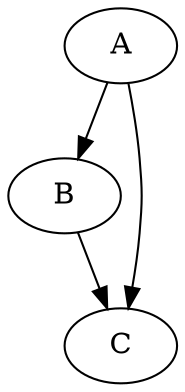
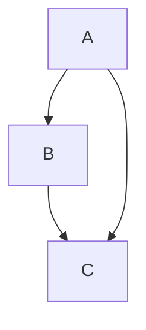
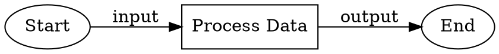
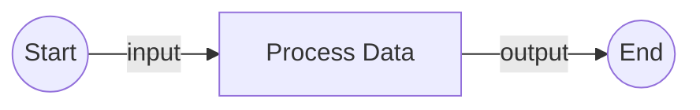

# DOT to Mermaid Converter

A self-contained module for converting DOT graph files to Mermaid diagram format.

## Module Contract

### Purpose
Transform DOT graph notation files into Mermaid diagram syntax, preserving graph structure, relationships, and visual attributes where possible.

### Approach
Deterministic pattern-based conversion using established rules for mapping DOT structures to Mermaid flowchart syntax.

### Key Features
- **Incremental progress saving** - Saves after EVERY file processed
- **Resume capability** - Skip already processed files on restart
- **Batch processing** - Handle entire directories of DOT files
- **Graceful degradation** - Continue processing even if some files fail

## Installation

Ensure dependencies are installed:
```bash
# The module uses these from the amplifier project:
# - amplifier.ccsdk_toolkit
# - amplifier.utils.logger
# - pydot (install if needed: uv add pydot)
```

## Usage

### Basic Usage

The tool accepts both individual files and directories:

```bash
# Convert all DOT files in a directory
python -m ai_working.dot_to_mermaid.cli /path/to/dot/files

# Convert a single file
python -m ai_working.dot_to_mermaid.cli /path/to/file.dot

# Using make (automatically stores session in .data/)
make dot-to-mermaid INPUT="/path/to/dot/files"
```

### Options

```bash
# Specify output directory
python -m ai_working.dot_to_mermaid.cli input_path --output mermaid_output

# Specify session file location (for progress tracking and resume)
python -m ai_working.dot_to_mermaid.cli input_path --session-file /path/to/session.json

# Clear previous session and start fresh
python -m ai_working.dot_to_mermaid.cli input_path --clear-session

# Verbose output for debugging
python -m ai_working.dot_to_mermaid.cli input_path --verbose

# Combine options
python -m ai_working.dot_to_mermaid.cli /path/to/files \
    --output mermaid_out \
    --session-file .data/session.json \
    --verbose
```

### Python API

```python
from ai_working.dot_to_mermaid import (
    parse_dot_file,
    convert_deterministic,
    SessionManager,
    ConversionResult
)

# Parse a DOT file
dot_graph = parse_dot_file(Path("graph.dot"))

# Convert to Mermaid
mermaid = convert_deterministic(dot_graph)

# Use session manager for batch processing
session = SessionManager()
session.set_total_files(10)
# ... process files ...
summary = session.get_summary()
```

## Module Architecture

```
dot_to_mermaid/
├── parser/              # DOT parsing brick
│   ├── __init__.py     # Public: parse_dot_file, parse_dot_string
│   └── dot_parser.py   # Implementation using pydot
├── converter/          # Conversion brick
│   ├── __init__.py     # Public: convert_deterministic
│   └── deterministic.py # Pattern-based conversion rules
├── session/            # Progress tracking brick
│   ├── __init__.py     # Public: SessionManager
│   └── manager.py      # Session state persistence
├── models.py           # Shared data structures
├── cli.py             # Command-line interface
└── __init__.py        # Module exports
```

## Data Models

### DotGraph
```python
@dataclass
class DotGraph:
    name: str                        # Graph name
    graph_type: str                  # "digraph" or "graph"
    nodes: dict[str, dict[str, Any]] # Node definitions
    edges: list[dict[str, Any]]      # Edge connections
    subgraphs: list[DotGraph]        # Nested subgraphs
    attributes: dict[str, Any]       # Graph-level attributes
    raw_source: str                  # Original DOT source
```

### ConversionResult
```python
@dataclass
class ConversionResult:
    source_file: Path           # Input DOT file
    mermaid_content: str       # Generated Mermaid
    conversion_method: str     # "deterministic", "failed", or "error"
    warnings: list[str]        # Any issues encountered
    success: bool              # Conversion status
```

## Conversion Examples

### Simple Directed Graph

**DOT Input:**


**Mermaid Output:**


### Graph with Attributes

**DOT Input:**


**Mermaid Output:**


## Session Management

The tool tracks progress in a session file, enabling:
- **Resume capability**: Restart interrupted conversions without reprocessing
- **Skip processed files**: Already converted files are skipped automatically
- **Batch reliability**: Continue even if individual files fail

**Default behavior:**
- Session file: `dot_conversion_session.json` in current directory
- Custom location: Use `--session-file` option
- Clear session: Use `--clear-session` flag

**Makefile integration:**
- When using `make dot-to-mermaid`, session is stored in `.data/dot_to_mermaid/session.json`
- This keeps project directory clean and git-friendly

## Performance Characteristics

- **Conversion speed**: ~10ms per file
- **Memory usage**: Minimal, processes one file at a time
- **Disk I/O**: Saves after every file (incremental)

## Error Handling

The converter handles several error scenarios:

1. **Parse failures** - Logs error and continues with next file
2. **Conversion failures** - Marks file as failed, continues processing
3. **File I/O errors** - Retries with exponential backoff (cloud sync handling)

## Limitations

- **Partial Mermaid support** - Not all DOT features have Mermaid equivalents
- **Complex layouts** - Some DOT layout hints may be lost
- **Custom shapes** - Limited shape mapping between formats
- **Styling** - Color and style attributes partially supported

## Testing

Test files are located in `/home/brkrabac/amplifier/content/dot-sources/`.

Run a test conversion:
```bash
python -m ai_working.dot_to_mermaid.cli /home/brkrabac/amplifier/content/dot-sources/ --verbose
```

## Regeneration Specification

This module can be fully regenerated from this specification. Key contracts:

- **Parser brick**: Accepts DOT file/string, returns DotGraph structure
- **Converter brick**: Accepts DotGraph, returns Mermaid string
- **Session brick**: Tracks progress, enables resume
- **CLI**: Orchestrates workflow with these bricks

The module follows the "bricks and studs" philosophy - each component is self-contained with clear interfaces.
