# Wireframe Standards

**Purpose**: Define when and how to create design artifacts (wireframes, flows, interaction specs) for Amplified Design features.

---

## When to Create Wireframes

### Complexity Thresholds

#### Simple Feature (Skip Detailed Wireframes)
**Criteria**:
- Single component or minor modification
- <3 interaction states
- No branching logic
- Linear user flow

**Artifact Requirements**:
- ✓ Design Brief only (emotional tone, palette, key interaction)
- ✗ No detailed wireframes needed
- ✗ No flow diagrams needed

**Example**: Adding a tooltip, changing button copy, adjusting spacing

---

#### Medium Feature (Lightweight Wireframes)
**Criteria**:
- Multiple components (2-4)
- 3-5 interaction states
- Simple conditional logic
- Mostly linear flow with 1-2 branches

**Artifact Requirements**:
- ✓ Design Brief (emotional tone, aesthetic approach)
- ✓ Simple Mermaid user flow
- ✓ Component hierarchy diagram
- ✓ Key interaction specifications
- ✗ Detailed wireframes optional

**Example**: Settings panel, palette switcher, notification system

---

#### Complex Feature (Full Wireframes)
**Criteria**:
- Component composition (5+ components)
- 5+ interaction states
- Branching logic with multiple decision points
- Multi-step flows or workflows
- Cross-page/cross-feature integration

**Artifact Requirements**:
- ✓ Design Brief (comprehensive aesthetic thinking)
- ✓ Detailed Mermaid user flows (all paths)
- ✓ Wireframes with aesthetic annotations
- ✓ Component hierarchy + props interfaces
- ✓ Complete interaction specifications (all states)
- ✓ Responsive behavior documentation

**Example**: Discovery canvas, multi-step wizard, authentication system, dashboard

---

## Design Brief Template

**Required for ALL features** (simple, medium, complex)

Location: Include at top of requirements doc or wireframe doc

```markdown
## Design Brief

### Feature
[Feature name]

### Emotional Goal
[What should this feel like? Playful? Serious? Confident? Inviting?]

### Visual Approach
- **Palette**: [Which themed palette or neutral approach?]
- **Key Colors**: [Background, text, accent choices]
- **Interactions**: [What creates delight? Discovery moments?]
- **Timing**: [500ms deliberate? 150ms responsive? Mix?]

### Key Interaction (The Magic Moment)
[The moment of delight - what makes this special? The "wow" moment]

### Reference
[Similar thing done well - Linear? Coolors? Stripe? Specific interaction?]

### Alignment Check
Does this feel like:
- [ ] Swedish design studio (playful + refined, warm + confident)
- [ ] NOT corporate office (sterile, safe, neutral)
- [ ] NOT generic (looks like everything else)
```

**Purpose**: Get aesthetic alignment BEFORE creating wireframes or code.

---

## Mermaid User Flow Diagrams

### When to Create
- Medium features (simple flows)
- Complex features (comprehensive flows)

### Mermaid Syntax Basics

#### Simple Linear Flow


#### Branching Flow with Decisions


#### Complex Flow with Multiple States


### Flow Diagram Best Practices

1. **Include ALL paths** - Happy path, error paths, edge cases
2. **Show decision points** - Use `{Decision?}` diamond shapes
3. **Label actions clearly** - Use active voice ("User clicks", "System validates")
4. **Note timing** - Include durations for important transitions
5. **Aesthetic states** - Include loading, error, success visual states

### Common Flow Patterns

#### Authentication Flow


#### CRUD Operation Flow

```mermaid
graph TD
  A[User views list] --> B{Items exist?}
  B -->|Yes| C[Display items]
  B -->|No| D[Show empty state]
  D --> E[User clicks Create]
  C --> F[User clicks item action]
  F --> G{Which action?}
  G -->|Edit| H[Open edit modal]
  G -->|Delete| I[Show delete confirmation]
  G -->|View| J[Navigate to detail view]
  H --> K[User modifies data]
  K --> L[Validates on blur]
  L --> M{Valid?}
  M -->|Yes| N[Enable save button]
  M -->|No| O[Show inline errors]
  O --> K
  N --> P[User clicks Save]
  P --> Q[Submit to backend]
  Q --> R{Success?}
  R -->|Yes| S[Show success toast]
  R -->|No| T[Show error message]
  S --> C
  T --> H
```


---

## Wireframe Creation

### When to Create Detailed Wireframes
- Complex features only (5+ components, multiple states)
- When layout is non-obvious
- When responsive behavior is complex
- When seeking early feedback on structure

### Wireframe Tools

#### Option 1: Mermaid Diagrams (Recommended for Speed)
**Pros**: Text-based, version control friendly, fast to create
**Cons**: Limited visual fidelity

**Example**:


#### Option 2: SVG Diagrams
**Pros**: More visual fidelity, still text-based
**Cons**: More time to create

**Example**:
```svg
<svg width="800" height="600" xmlns="http://www.w3.org/2000/svg">
  <!-- Header -->
  <rect x="0" y="0" width="800" height="80" fill="#f0f0f0" stroke="#000" />
  <text x="20" y="50" font-size="16">Header: Logo | Navigation | User Menu</text>

  <!-- Main Content -->
  <rect x="0" y="100" width="600" height="400" fill="#fff" stroke="#000" />
  <text x="300" y="300" text-anchor="middle" font-size="16">Main Content Area</text>

  <!-- Sidebar -->
  <rect x="620" y="100" width="180" height="400" fill="#f9f9f9" stroke="#000" />
  <text x="710" y="300" text-anchor="middle" font-size="14">Sidebar</text>

  <!-- Footer -->
  <rect x="0" y="520" width="800" height="80" fill="#f0f0f0" stroke="#000" />
  <text x="20" y="560" font-size="14">Footer: Links | Copyright</text>
</svg>
```

#### Option 3: Excalidraw/Figma Embeds
**Pros**: High visual fidelity, collaborative
**Cons**: Not text-based, harder to version control

**Usage**: Export as PNG/SVG, embed in markdown

### Wireframe Annotations

Always include:

#### 1. Component Labels
```
[ComponentName]
- Purpose: [What this component does]
- State: [Default, hover, active, loading, error, success]
```

#### 2. Spacing Callouts
```
Padding: 24px (from 8px system)
Margin-bottom: 48px (major section separation)
Gap: 16px (between related items)
```

#### 3. Typography Specs
```
Heading: Sora 32px / 700 / --text-primary
Body: Geist Sans 16px / 400 / --text-secondary
```

#### 4. Color Zones
```
Background: --bg-soft (warm neutral)
Accent: --accent-current (from active palette)
Text: --text-primary (vibrant, 4.5:1 contrast)
```

#### 5. Interaction Notes
```
Hover: Lift 2px + colored shadow (150ms ease-out)
Click: Scale 0.98 + accent background
Loading: Spinner + 60% opacity
```

#### 6. Responsive Breakpoints
```
Mobile (<640px): Stack vertically, 16px padding
Tablet (640-1024px): 2-column grid, 24px padding
Desktop (>1024px): 3-column grid, 48px padding
```

---

## Component Hierarchy Diagrams

### Purpose
Show how React components nest and compose

### Format

#### Simple Tree Notation
```
<FeatureName>
  <FeatureHeader>
    <Logo />
    <Navigation>
      <NavItem /> (×5)
    </Navigation>
    <UserMenu>
      <Avatar />
      <Dropdown>
        <MenuItem /> (×3)
      </Dropdown>
    </UserMenu>
  </FeatureHeader>
  <FeatureContent>
    <Sidebar>
      <FilterGroup>
        <FilterOption /> (×8)
      </FilterGroup>
    </Sidebar>
    <MainContent>
      <ContentGrid>
        <ContentCard /> (×12, dynamic)
      </ContentGrid>
    </MainContent>
  </FeatureContent>
  <FeatureFooter>
    <FooterLinks />
    <Copyright />
  </FeatureFooter>
</FeatureName>
```

#### Mermaid Graph Notation


### Include for Each Component

**Component Name**: `<ComponentName>`

**Purpose**: [One sentence - what this component does]

**Props** (if known):
```typescript
interface ComponentProps {
  variant?: 'default' | 'accent'
  size?: 'sm' | 'md' | 'lg'
  onAction?: () => void
}
```

**State**: [What state this component manages, if any]

**Children**: [What can be nested inside]

---

## Interaction Specifications

### When to Create
- Medium features: Key interactions only
- Complex features: All interactions

### Template for Each Interactive Element

```markdown
## [Component Name] - Interaction Specification

### Default State
- **Visual**: [Appearance at rest]
- **Cursor**: [pointer, default, text]
- **ARIA**: [ARIA attributes]

### Hover State
- **Trigger**: Mouse enters bounds OR keyboard focus
- **Timing**: [150ms ease-out]
- **Transform**: [translateY(-2px) scale(1.02)]
- **Shadow**: [0 8px 16px [accent]40]
- **Color**: [Any color changes]
- **Cursor**: [pointer]
- **ARIA**: [aria-hovered if applicable]

### Focus State (Keyboard)
- **Trigger**: Tab navigation OR programmatic focus
- **Visual**: [2px accent outline, 2px offset]
- **No motion**: [Respect focus without motion for a11y]
- **ARIA**: [Focus management, aria-expanded if applicable]

### Active/Press State
- **Trigger**: Mouse down OR touch start OR Enter/Space key
- **Timing**: [100ms ease-out]
- **Transform**: [translateY(0) scale(0.98)]
- **Color**: [Any color changes]
- **ARIA**: [aria-pressed="true" if toggle]

### Loading State
- **Trigger**: [Action initiated, waiting for response]
- **Visual**: [Spinner icon, 60% opacity]
- **Disabled**: true
- **Cursor**: not-allowed
- **Duration**: [Expected duration or timeout]
- **ARIA**: [aria-busy="true", aria-label="Loading..."]

### Error State
- **Trigger**: [Validation failure or operation error]
- **Visual**: [Red border, error icon, error message below]
- **Color**: [--color-error or semantic error color]
- **Message**: ["Specific error message explaining what's wrong"]
- **Recovery**: [How user fixes error]
- **ARIA**: [aria-invalid="true", aria-describedby="error-id"]

### Success State
- **Trigger**: [Operation completed successfully]
- **Visual**: [Green checkmark, success message]
- **Color**: [--color-success or semantic success color]
- **Duration**: [Auto-dismiss after 3s OR persist until dismissed]
- **ARIA**: [role="alert", aria-live="polite"]

### Disabled State
- **Trigger**: [Conditions where element is not interactive]
- **Visual**: [40% opacity, no hover effects]
- **Cursor**: not-allowed
- **Behavior**: [No events fire, screen reader announces "disabled"]
- **ARIA**: [aria-disabled="true" OR disabled attribute]

### Reduced Motion Fallback
- **Trigger**: [prefers-reduced-motion: reduce]
- **Behavior**: [All transitions <50ms, no transform animations]
- **Alternatives**: [Instant feedback, color-only changes]
```

### Example: Button Interaction Spec

```markdown
## PaletteButton - Interaction Specification

### Default State
- **Visual**: Themed accent background, white text, 44x44px
- **Cursor**: pointer
- **ARIA**: aria-label="Change color palette"

### Hover State
- **Trigger**: Mouse enters OR keyboard focus
- **Timing**: 150ms ease-out
- **Transform**: translateY(-2px) scale(1.02)
- **Shadow**: 0 8px 16px [--accent-current]40
- **Cursor**: pointer

### Focus State (Keyboard)
- **Trigger**: Tab navigation
- **Visual**: 2px solid [--accent-current] outline, 2px offset
- **No motion**: Static, no transform
- **ARIA**: Focus visible

### Active/Press State
- **Trigger**: Mouse down OR touch start OR Enter key
- **Timing**: 100ms ease-out
- **Transform**: translateY(0) scale(0.98)

### Loading State
- **Trigger**: Palette transition in progress
- **Visual**: 60% opacity, no hover effects
- **Disabled**: true (prevent rapid clicking)
- **Duration**: 500ms (palette transition time)
- **ARIA**: aria-busy="true", aria-label="Changing palette..."

### Success State
- **Trigger**: Palette change completed
- **Visual**: Brief scale pulse (1.0 → 1.05 → 1.0 over 200ms)
- **Duration**: Single pulse, then return to default
- **ARIA**: aria-live="polite" announces "Palette changed to [name]"

### Disabled State
- **Trigger**: No palettes available (edge case)
- **Visual**: 40% opacity, no hover
- **Cursor**: not-allowed
- **ARIA**: aria-disabled="true", aria-label="No palettes available"

### Reduced Motion Fallback
- **Trigger**: prefers-reduced-motion: reduce
- **Behavior**:
  - Hover: Color change only, no transform
  - Palette transition: Instant (<50ms)
  - Success pulse: Skipped
```

---

## Responsive Design Documentation

### Breakpoint Strategy

**Our breakpoints**:
```css
/* Mobile-first approach */
--breakpoint-sm: 640px   /* Small tablets */
--breakpoint-md: 768px   /* Tablets */
--breakpoint-lg: 1024px  /* Desktops */
--breakpoint-xl: 1280px  /* Large desktops */
```

### Document for Each Breakpoint

#### Mobile (<640px)
**Layout**:
- [How does layout adapt? Stack? Hide elements?]

**Touch Interactions**:
- [All targets 44x44px minimum]
- [Thumb zones optimized (bottom third priority)]

**Typography**:
- [Base size 16px minimum]
- [Hierarchy adjustments]

**Spacing**:
- [Tighter spacing - 16px padding, 24px major sections]

**Interactions**:
- [No hover states (use touch feedback)]
- [Simplified interactions]

#### Tablet (640px - 1024px)
**Layout**:
- [Hybrid - side-by-side where appropriate]

**Interactions**:
- [Support both touch and hover]

**Spacing**:
- [Medium - 24px padding, 32px major sections]

#### Desktop (>1024px)
**Layout**:
- [Full multi-column, side-by-side]

**Interactions**:
- [Rich hover states]
- [Keyboard shortcuts]
- [Precise mouse targeting]

**Spacing**:
- [Generous - 48px padding, 48px major sections]

---

## Accessibility Documentation

### Required for All Features

#### ARIA Labels
```html
<button aria-label="Descriptive action label">
  <Icon aria-hidden="true" />
  <span>Text</span>
</button>
```

#### Keyboard Navigation
```
Tab Order:
1. [First focusable element]
2. [Second focusable element]
3. [Third focusable element]
...

Shortcuts:
- Cmd/Ctrl + K: [Action]
- Escape: [Action]
- Enter: [Action]
```

#### Screen Reader Announcements
```
State Change: [What's announced]
- On load: "[Initial state description]"
- On action: "[Result of action]"
- On error: "[Specific error message]"

Live Regions:
- aria-live="polite": [For non-urgent updates]
- role="alert": [For errors and important updates]
```

#### Focus Management
```
Modal Opens:
1. Focus moves to modal
2. Focus trapped within modal
3. Escape closes modal
4. Focus returns to trigger element

Dropdown Opens:
1. Focus moves to first item
2. Arrow keys navigate
3. Enter selects
4. Escape closes, returns focus
```

#### Color Contrast
```
Text: 4.5:1 minimum (WCAG AA)
- [--text-primary] on [--bg-primary]: [ratio]
- [--text-secondary] on [--bg-primary]: [ratio]

UI Components: 3:1 minimum
- [--accent] on [--bg-primary]: [ratio]
- [--border] on [--bg-primary]: [ratio]

Tool: Use WebAIM Contrast Checker
```

---

## File Naming & Organization

### Requirements Documents
**Location**: `.design/requirements/`
**Naming**: `[feature-name].md`
**Example**: `.design/requirements/palette-switcher.md`

### Wireframe Documents
**Location**: `.design/wireframes/`
**Naming**: `[feature-name]-ux.md`
**Example**: `.design/wireframes/palette-switcher-ux.md`

### Example Project Structure
```
.design/
├── requirements/
│   ├── palette-switcher.md
│   ├── discovery-canvas.md
│   └── auth-system.md
├── wireframes/
│   ├── palette-switcher-ux.md
│   ├── discovery-canvas-ux.md
│   └── auth-system-ux.md
├── REQUIREMENTS-TEMPLATE.md
├── WIREFRAME-STANDARDS.md (this file)
└── ...
```

---

## Quality Checklist for Design Artifacts

Before finalizing any wireframe or design artifact, verify:

### Design Brief
- [ ] Emotional tone clearly defined
- [ ] Palette choice made with rationale
- [ ] Key interaction (magic moment) identified
- [ ] Reference examples provided
- [ ] Alignment with Swedish studio vibe confirmed

### User Flows
- [ ] All paths documented (happy, error, edge cases)
- [ ] Decision points clearly marked
- [ ] Timing noted for important transitions
- [ ] Aesthetic states included (loading, success, error)

### Wireframes (if created)
- [ ] Component labels clear
- [ ] Spacing from 8px system annotated
- [ ] Typography specs provided
- [ ] Color zones identified
- [ ] Interaction notes included
- [ ] Responsive behavior documented

### Component Hierarchy
- [ ] All components listed
- [ ] Purpose of each component stated
- [ ] Props interfaces defined (TypeScript)
- [ ] State management approach chosen

### Interaction Specs
- [ ] All states documented (default, hover, focus, active, loading, error, success, disabled)
- [ ] Timing specified for each transition
- [ ] ARIA attributes defined
- [ ] Reduced motion fallback included

### Accessibility
- [ ] ARIA labels for all interactive elements
- [ ] Keyboard navigation flow defined
- [ ] Screen reader announcements specified
- [ ] Focus management strategy documented
- [ ] Color contrast verified (4.5:1 text, 3:1 UI)
- [ ] Touch targets 44x44px minimum

### Responsive Design
- [ ] Mobile layout (<640px) defined
- [ ] Tablet layout (640-1024px) defined
- [ ] Desktop layout (>1024px) defined
- [ ] Touch vs hover interactions differentiated

---

## Examples

See these files for reference examples:
- `.design/requirements/palette-switcher.md` (if exists)
- `.design/wireframes/palette-switcher-ux.md` (if exists)

---

## Remember

**Design artifacts serve two purposes**:
1. **Communication** - Help team align on what's being built
2. **Implementation guide** - Enable engineers to build with clarity

**Balance fidelity with speed**:
- Simple features: Design brief only
- Medium features: Brief + flow + component hierarchy
- Complex features: Full wireframes + specs

**Aesthetic-first always**:
- Establish emotional tone BEFORE functional specs
- Polish is intrinsic, not added later
- Every wireframe embodies our Nine Dimensions

**Quality at creation beats debugging later.**
